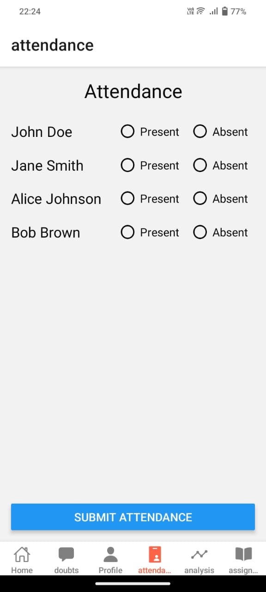

# Smart Classroom Application

## Overview

Traditional classrooms often struggle with inefficiencies such as manual attendance tracking, rigid timetables, limited access to learning resources, and a lack of personalized support for students. These challenges can lead to decreased engagement, wasted time, and ineffective learning. 

To overcome these issues, we are developing the **Smart Classroom Application**, an innovative platform that leverages technology to create a seamless, interactive, and personalized educational experience.

## Key Features

### 1. Automated Attendance System
Our automated system eliminates the need for manual attendance tracking, saving time and ensuring accuracy. Attendance is tracked digitally, giving teachers more time to focus on teaching.

### 2. Smart Timetable
A smart timetable feature dynamically adapts and optimizes class schedules based on classroom availability and student needs. This increases flexibility and ensures efficient use of class hours.

### 3. Centralized Learning Dashboard
The dashboard acts as a central hub for students, where they can access all learning materials, submit assignments, and engage with interactive content. It also provides a space for students to ask questions and resolve doubts.

### 4. AI-Powered Chatbot for Academic Assistance
An AI-driven chatbot is available to provide instant support for academic questions, helping students with quick explanations, resource suggestions, and guidance on study topics.

### 5. Interactive Quizzes & Digital Whiteboard
The app includes interactive quizzes that enhance learning through real-time feedback and a digital whiteboard for live classes and seminars, promoting collaboration and active participation.

### 6. AI-Driven Note Summarization
This feature converts lengthy PDFs and documents into concise notes and question banks, saving time for students and enabling more effective studying.

### 7. Speech-to-Text and Multi-Language Support
The app provides speech-to-text conversion and supports multiple languages, ensuring accessibility for students from diverse linguistic backgrounds.

## Impact

Our **Smart Classroom Application** not only reduces administrative workload but also enhances student participation and engagement. By integrating these cutting-edge features, we aim to foster an inclusive, adaptive, and engaging learning environment for all students.

## Benefits

- **Efficiency**: Automates time-consuming tasks like attendance and scheduling, saving time for both students and teachers.
- **Accessibility**: Makes learning more accessible with multi-language support and AI tools that assist in note summarization and doubt resolution.
- **Engagement**: Offers interactive tools like quizzes, digital whiteboards, and instant chatbots, keeping students engaged and motivated.

## Screenshots of present UI

### Smart Timetable and Dashboard

### AI-Powered Chatbot

### Interactive Quizzes

### Digital Whiteboard and Note Summarization

## Conclusion

The **Smart Classroom Application** transforms the traditional educational model into a smarter, more interactive, and more efficient system. By integrating advanced technologies, we are paving the way for a future where learning is accessible, personalized, and engaging for all.

---

